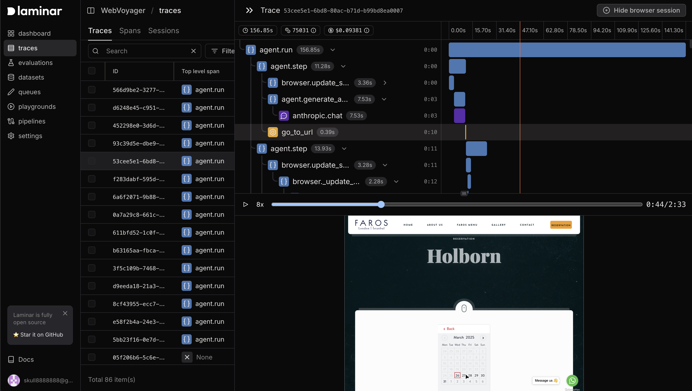

<a href="https://www.ycombinator.com/companies/laminar-ai"></a>
<a href="https://x.com/lmnrai"></a>
<a href="https://discord.gg/nNFUUDAKub">  </a>

# Index

Index is the SOTA open-source browser agent for autonomously executing complex tasks on the web.

- [x] Powered by reasoning LLMs with vision capabilities using AI SDK.
    - [x] Gemini 2.5 Pro (really fast and accurate)
    - [x] Claude 3.7 Sonnet with extended thinking (reliable and accurate)
    - [x] OpenAI o4-mini (depending on the reasoning effort, provides good balance between speed, cost and accuracy)
    - [x] Gemini 2.5 Flash (really fast, cheap, and good for less complex tasks)
- [] [WIP]`index run` to run the agent in the interactive CLI
- [x] Index is also available as a [serverless API.](https://docs.lmnr.ai/index-agent/api/getting-started)
- [x] You can also try out Index via [Chat UI](https://lmnr.ai/chat).
- [x] Supports advanced [browser agent observability](https://docs.lmnr.ai/index-agent/tracing) powered by open-source platform [Laminar](https://github.com/lmnr-ai/lmnr).
- [x] `npm install @lmnr-ai/index` and use it in your project

prompt: go to ycombinator.com. summarize first 3 companies in the W25 batch and make new spreadsheet in google sheets.

https://github.com/user-attachments/assets/2b46ee20-81b6-4188-92fb-4d97fe0b3d6a

## Documentation

Check out full documentation [here](https://docs.lmnr.ai/index-agent/getting-started)

## Install dependencies

```bash
npm install @lmnr-ai/index
```

### Setup model API keys

Setup your model API keys in `.env` file in your project root:

```bash
GOOGLE_GENERATIVE_AI_API_KEY=
ANTHROPIC_API_KEY=
OPENAI_API_KEY=
```

### Run Index with code
```javascript
import { google } from "@ai-sdk/google";

async function main() {
  // Any provider and model can go here as long as it supports vision
  const agent = new Agent(google("gemini-2.5-pro-preview-05-06"));

  const output = await agent.run({
    prompt: "Navigate to news.ycombinator.com, find a post about AI, and summarize it",
  });
  console.log(output.result);
}

// .catch to avoid top level awaits
main().catch((e) => console.error(e));
```

#### Streaming mode

```javascript
import { google } from "@ai-sdk/google";

async function main() {
  const agent = new Agent(google("gemini-2.5-pro-preview-05-06"));
  const output = await agent.runStream({
    prompt: "Navigate to news.ycombinator.com, find a post about AI, and summarize it",
  });
  
  for await (const chunk of output) {
    console.log(chunk);
  }
}

// .catch to avoid top level awaits
main().catch((e) => console.error(e));
```

#### Control logging level

By default, Index log level is warn and above, which is quite silent. You can set the log level by setting the LMNR_LOG_LEVEL environment variable, e.g.

```bash
export LMNR_LOG_LEVEL=info
```

## Use Index via API

The easiest way to use Index in production is with [serverless API](https://docs.lmnr.ai/index-agent/api/getting-started). Index API manages remote browser sessions, agent infrastructure and [browser observability](https://docs.lmnr.ai/index-agent/api/tracing). To get started, create a project API key in [Laminar](https://lmnr.ai).

### Install Laminar
```bash
npm install @lmnr-ai/lmnr
```

### Make an API call
```javascript
import { LaminarClient, Laminar } from '@lmnr-ai/lmnr';

// Initialize tracing first
Laminar.initialize();

const client = new LaminarClient({
  projectApiKey:"<YOUR_PROJECT_API_KEY>",
});

const response = await client.agent.run({
    prompt: "What is the weather in London today?",
});

for await (const chunk of response) {
  console.log(chunk.chunkType)
  if (chunk.chunkType === 'step') {
    console.log(chunk.summary);
  } else if (chunk.chunkType === 'finalOutput') {
    console.log(chunk.content.result);
  }
}
```


## Browser agent observability

Both code run and API run provide advanced browser observability. To trace Index agent's actions and record browser session you simply need to initialize Laminar tracing before running the agent.

```javascript
import { Laminar } from '@lmnr-ai/lmnr';

Laminar.initialize({
    projectApiKey: "<YOUR_PROJECT_API_KEY>"
})
```

This line above must be run at your application entrypoint after initializing any other OpenTelemetry tracing.

For Next.js apps, place this in `register` in `instrumentation.ts` ([Learn more](https://docs.lmnr.ai/tracing/integrations/nextjs)).

Then you will get full observability on the agent's actions synced with the browser session in the Laminar platform. Learn more about browser agent observability in the [documentation](https://docs.lmnr.ai/laminar-index/observability).

<picture>
    
</picture>

---

Made with ❤️ by the [Laminar team](https://lmnr.ai)
